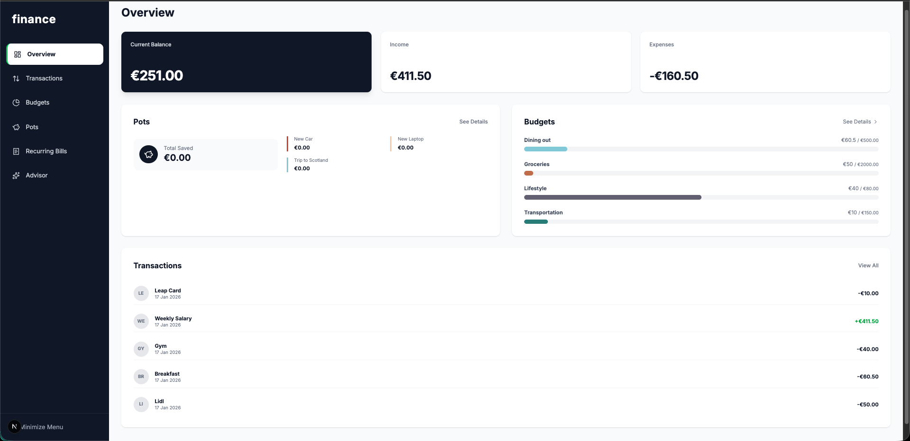
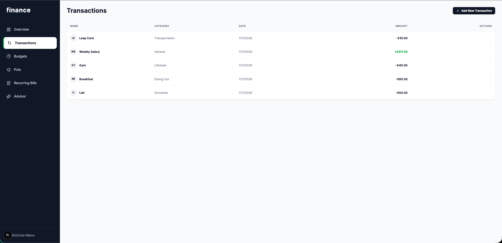
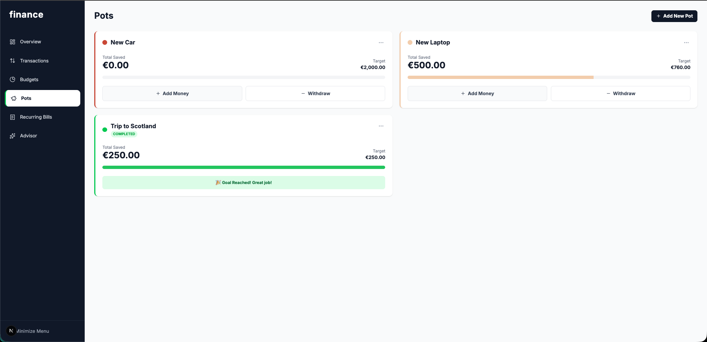
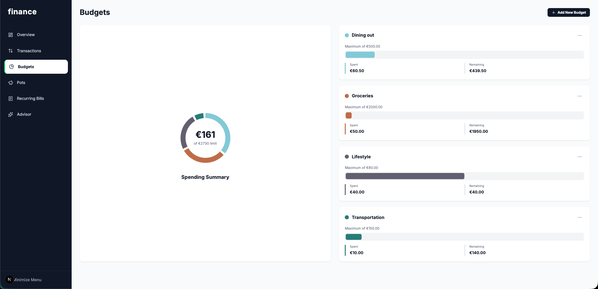
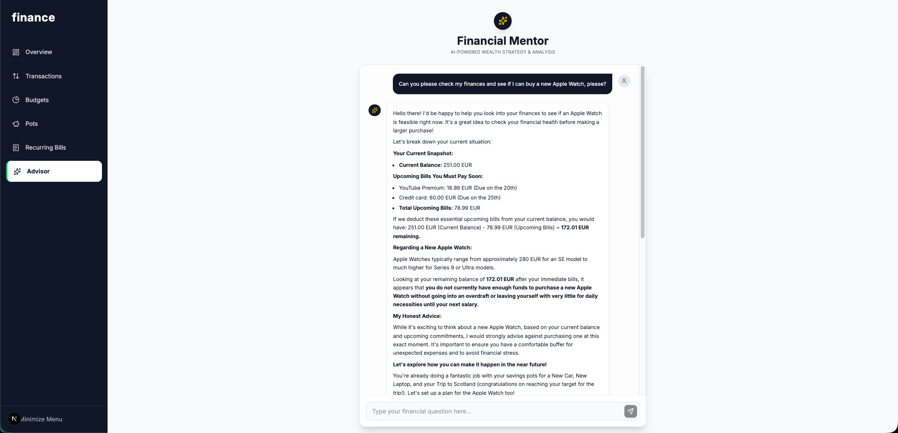

# 💰 Personal Finance Dashboard


> A powerful Full-Stack financial management platform tailored for personal wealth tracking. Built with a decoupled architecture using **Laravel API** and **Next.js**.

[](https://nextjs.org/)
[](https://laravel.com/)
[](https://www.php.net/)
[](https://www.typescriptlang.org/)
[](https://www.docker.com/)
[](https://tailwindcss.com/)

---

## 🎥 Demo

### **[▶️ Click Here to Watch the Video Walkthrough](SEU_LINK_DO_VIDEO_AQUI)**

> _Since this is a portfolio project with complex infrastructure, I have recorded a full demonstration covering the AI Advisor, Real-time Transactions, and Budgeting features._

---

## 🚀 Overview

This application modernizes personal finance tracking by combining a robust PHP backend with a reactive React frontend. It solves the problem of scattered financial data by centralizing budgets, recurring bills, and savings goals in one interactive dashboard.

### Key Architecture

-   **Monorepo Structure:** Clear separation of concerns with dedicated `backend` (API) and `frontend` (Client) directories.
-   **RESTful API:** The Laravel backend serves JSON data, handling complex business logic, database relationships, and AI integration.
-   **Type-Safe Client:** The Next.js frontend utilizes strict TypeScript interfaces to ensure data integrity and reduce runtime errors.

---

## ✨ Key Features

### 📊 Interactive Dashboard

A holistic view of your financial health. The dashboard aggregates data from all modules to show current balance, total expenses, and savings at a glance.

-   **Tech:** Recharts for data visualization.
-   **UX:** Summary cards with instant visual feedback.



### 💸 Transaction Management (CRUD)

Complete control over your spending history. Users can create, edit, and delete transactions with automatic categorization.

-   **Features:** Search, filter by category, and pagination.
-   **Backend:** Optimized Eloquent queries for fast data retrieval.



### 🧾 Recurring Bills Tracking

Never miss a payment again. This module tracks monthly subscriptions and bills (e.g., Netflix, Rent, Electricity).

-   **Logic:** visually identifies paid vs. due bills.
-   **Insight:** Calculates the total monthly fixed cost automatically.


### 🏺 Savings Pots

Visual savings goals. Create "Pots" for specific objectives (Travel, Car, Emergency Fund).

-   **Interactivity:** "Add Money" and "Withdraw" buttons update the pot progress and adjust the main balance in real-time.



### 📉 Smart Budgets

Set spending limits for specific categories (e.g., "Dining Out", "Transport") to keep your finances on track.

-   **Visuals:** Color-coded progress bars indicate how close you are to the limit.



### 🤖 AI Financial Advisor

Context-aware financial guidance powered by OpenAI.

-   **Integration:** The Laravel backend securely communicates with OpenAI, feeding anonymized transaction history to generate personalized savings advice.



---

## 🛠️ Tech Stack & Structure

Based on the project's codebase:

| Component    | Technology                  | Details                                         |
| :----------- | :-------------------------- | :---------------------------------------------- |
| **Frontend** | **Next.js 14** (App Router) | Server Actions, TypeScript, Axios, Tailwind CSS |
| **Backend**  | **Laravel 10**              | PHP 8.2, Eloquent ORM, API Resources            |
| **Database** | **PostgreSQL / MySQL**      | Managed via Laravel Migrations                  |
| **DevOps**   | **Docker**                  | Containerized backend environment               |

### 📂 Project Structure

```bash
FINANCE-APP/
├── backend/                 # Laravel API
│   ├── app/
│   │   ├── Http/Controllers # Transaction & Budget Controllers
│   │   └── Models/          # Eloquent Models
│   ├── database/            # Migrations & Seeders
│   ├── routes/              # API Routes definition
│   ├── Dockerfile           # Container configuration
│   └── compose.yaml         # Docker Compose setup
│
├── frontend/                # Next.js Application
│   ├── app/                 # App Router (Budgets, Pots, Advisor pages)
│   ├── components/          # Reusable UI (Charts, Sidebar)
│   ├── types/               # TS Interfaces
│   └── lib/                 # Utilities
│
└── screenshots/             # Demo images
```

## ⚡ Getting Started (Local Development)

Follow these steps to run the full stack locally.

### Prerequisites

-   Docker (Optional, for backend) OR PHP 8.2+ & Composer
-   Node.js (v18+) & npm

### 1. Setup Backend (Laravel)

```bash
cd backend

# Install PHP dependencies
composer install

# Environment setup
cp .env.example .env
# (Configure your DB credentials in .env)

# Generate App Key
php artisan key:generate

# Run Migrations & Seeds
php artisan migrate --seed

# Start Server
php artisan serve
# API will be available at http://localhost:8000
```

### 2. Setup Frontend (Next.js)

```bash
cd ../frontend

# Install Node dependencies
npm install

# Environment setup
# Create a .env.local file and add:
# NEXT_PUBLIC_API_URL=http://localhost:8000/api

# Start Client
npm run dev
# App will be available at http://localhost:3000
```

---

## 🔮 Future Improvements

While the application is fully functional, here is the roadmap for future updates:

-   [ ] **Authentication:** Implement full user auth (Login/Register) using Laravel Sanctum.
-   [ ] **Dark Mode:** Add a system-wide theme toggle for better accessibility.
-   [ ] **Unit Testing:** Increase coverage adding PHPUnit tests for the backend and Jest for frontend components.
-   [ ] **CI/CD Pipeline:** Automate deployment workflows using GitHub Actions.

## 👨‍💻 Author

**William Dias**

-   [LinkedIn](https://www.linkedin.com/in/williampgdias/)

---

_This project is a showcase of Full-Stack capabilities, demonstrating the integration between a structured PHP backend and a modern React framework._

## 📄 License

This project is open-source and available under the [MIT License](https://opensource.org/licenses/MIT).
